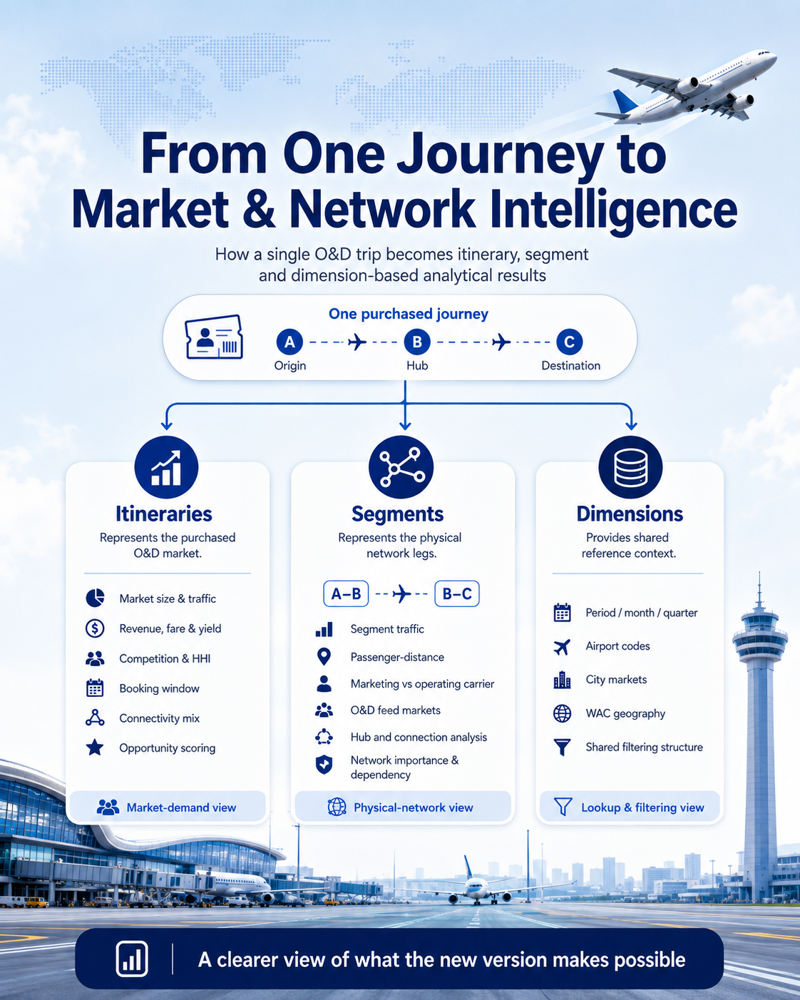

# Traffic Market & Network Analysis

**Expanded analytical results from BTS O&D data — linking purchased journeys with the physical network used to transport them.**

This repository presents the expanded results of the **Traffic Market Analysis** project. Rather than focusing on the program code itself, it shows what can now be analysed after separating the complete O&D journey purchased by the passenger from the individual flight segments, hubs and network relationships behind that journey.

## 1. Itineraries Analytics

Itineraries represent the complete journey purchased by the passenger. This is the correct level for analysing O&D demand, passengers, revenue, fare, yield, competition, booking behaviour, connectivity, seasonality and relative market opportunity.

| Output | Main purpose |
|---|---|
| `market_core_summary` | Traffic, revenue, fare, yield, distance and growth |
| `market_competition_summary` | Carrier leadership, coverage, shares and concentration |
| `market_connectivity_summary` | Nonstop/connecting demand and journey complexity |
| `market_booking_summary` | Purchase-window behaviour and fares |
| `market_airport_summary` | Airport-pair analysis |
| `market_wac_summary` | Regional and WAC flows |
| `market_seasonality_summary` | Seasonal profile and peak periods |
| `market_opportunity_summary` | Relative market prioritisation |

[Read the detailed itinerary documentation](docs/itineraries_analytics.md)  
[Explore itinerary sample tables](examples/itineraries/)

## 2. Segments Analytics

Segments represent the physical legs used to transport O&D demand. This perspective adds passenger-segment traffic, passenger-distance, marketing and operating carriers, connection dependency, O&D feeds, hubs and network concentration.

| Output | Main purpose |
|---|---|
| `segment_core_summary` | Physical traffic, distance and connection dependency |
| `segment_competition_summary` | Marketing and operating carrier concentration |
| `segment_feed_summary` | O&D markets feeding each physical segment |
| `market_segment_summary` | Physical segments used by each O&D market |
| `market_connection_summary` | Hubs, connection concentration and dwell |
| `segment_network_summary` | Combined network importance, feed and dependency view |
| `bridge_od_city_segment` | Detailed O&D city-market ↔ physical-segment relationship |

The bridge is stored with the segment outputs because it is not a descriptive dimension: it contains the market–segment relationship itself together with passenger-segment measures and two complementary shares.

[Read the detailed segment documentation](docs/segments_analytics.md)  
[Explore segment sample tables](examples/segments/)

## 3. Integrated Market & Network Analytics

The new `bridge_od_city_segment` makes the relationship between the two analytical perspectives explicit. It keeps one row for a **period + O&D city market + physical segment** combination and includes both:

- `segment_mix_share_within_od`: how important the segment is inside the selected O&D market;
- `od_feed_share_within_segment`: how important the O&D market is inside the selected physical segment.

This allows the same relationship to be explored in both directions without confusing the denominators.

Examples include:

- starting with a high-volume O&D market and identifying the physical segments carrying it;
- measuring which segment is most important inside that market;
- starting with a physical segment and identifying the O&D markets feeding it;
- comparing the selected market with the other markets sharing the same leg;
- combining market-level competition with marketing and operating carriers at segment level;
- identifying the main hubs used by connecting passengers;
- filtering the analysis through shared period, airport, city-market and WAC dimensions.

The bridge links **analytical O&D markets** to physical segments. It is not a row-by-row link to every individual itinerary record; that lower-level relationship belongs to the underlying itinerary/segment data through `itinerary_id`.

[Read the integrated analytics documentation](docs/integrated_analytics.md)

## 4. Possible Uses

The resulting structure can support market intelligence, route-opportunity screening, network planning, hub analysis, airport strategy, carrier analysis, feed/dependency studies and interactive dashboards.

[Read the detailed possible-uses documentation](docs/possible_uses.md)

## Sample Outputs

The repository includes five-row samples of the final analytical outputs:

- [Complete Excel workbook](examples/Traffic_Market_Network_Analysis_sample_outputs.xlsx)
- [Itinerary outputs](examples/itineraries/)
- [Segment and bridge outputs](examples/segments/)
- [Shared dimensions](examples/dimensions/)

The corrected `segment_network_summary` and the new `bridge_od_city_segment` are included in these samples.

## Same-origin and destination flags

Boolean fields identify whether origin and destination refer to the same airport, city market or WAC. Equivalent flags are available for physical segments.

They can be used to exclude same-point records from standard rankings, study circular/repeated flows separately and support anomaly screening. A same-origin/destination segment does not by itself prove a return-to-origin operational event.

## Technology and data

- BTS DB1B and DB1C O&D survey data
- Python
- DuckDB
- PyArrow and Parquet
- YAML-based aggregation and analytics definitions
- Monthly and quarterly analytical outputs

## Documentation

- [Itineraries Analytics](docs/itineraries_analytics.md)
- [Segments Analytics](docs/segments_analytics.md)
- [Integrated Market & Network Analytics](docs/integrated_analytics.md)
- [Possible Uses](docs/possible_uses.md)
- [Project Overview](docs/project_overview.md)
- [Project Architecture](docs/project_architecture.md)

## Interpretation notes

- `passengers` at itinerary level represents purchased O&D demand.
- `segment_passengers` represents passenger-segments and can count the same traveller on several legs.
- Revenue, fare and yield remain itinerary-level measures.
- Monthly and quarterly results must be separated with `period_type`.
- Opportunity and network scores are relative rankings, not demand forecasts or automatic route-opening recommendations.
