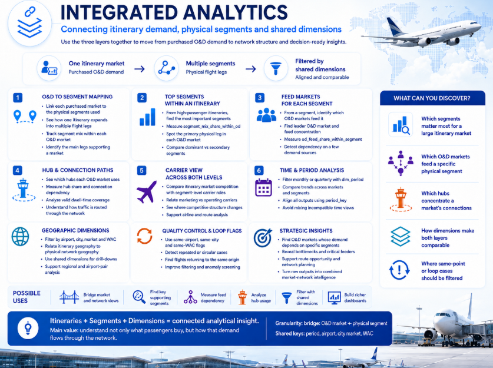

# Integrated Market & Network Analytics

## The connection between demand and network structure

The central improvement of the expanded project is the ability to move from the purchased O&D market to the physical network used to transport it, and then move back from a physical segment to the O&D markets that feed it.

The itinerary branch answers:

> What journey did the passenger buy?

The segment branch answers:

> Which physical legs, carriers and hubs transported that demand?

`bridge_od_city_segment` provides the detailed analytical connection between those two perspectives.

## Bridge grain

One bridge row represents:

**period + O&D city market + physical airport segment**

The row includes:

- origin and destination city market;
- O&D city-market keys;
- segment origin and destination airport;
- directional and bidirectional segment keys;
- `segment_passengers`;
- `segment_passenger_distance`;
- `segment_mix_share_within_od`;
- `od_feed_share_within_segment`.

This means the table is more than a simple key-mapping bridge: it is a measurable many-to-many relationship between market demand and physical network use.

## From an O&D market to its segments

Suppose an itinerary market has high passenger volume or ranks strongly in `market_opportunity_summary`.

The bridge can be filtered to that O&D city market to show every physical segment used by the market. `segment_mix_share_within_od` then shows the importance of each leg inside the selected market.

This allows questions such as:

- What are the main physical segments carrying this O&D demand?
- Is the market concentrated on one main routing or distributed across many legs?
- Which segment carries the largest share of its passenger-segment traffic?
- Does the selected market rely on one dominant connection path?
- Which segments should be analysed next for carrier structure or connection dependency?

The analysis can then continue into `segment_network_summary` or `segment_competition_summary` for the selected legs.

## From a segment to its O&D markets

The same bridge can be filtered in the opposite direction by physical segment.

`od_feed_share_within_segment` then shows how much each O&D market contributes to that leg.

This answers:

- Which O&D markets are actually supporting the segment?
- Is the leg dependent on one major feed?
- Which high-value or high-volume markets use it?
- How diversified is the segment across passenger markets?
- Which markets would be most relevant when evaluating the role of that leg in the wider network?

`segment_feed_summary` provides a compact summary of this perspective, while the bridge preserves the detailed pair-level rows.

## Why the two shares are different

The two bridge shares use different denominators:

- `segment_mix_share_within_od` = segment's weight inside the selected O&D market;
- `od_feed_share_within_segment` = O&D market's weight inside the selected physical segment.

A segment can therefore be extremely important for one O&D market while that same market represents only a small part of the segment's total traffic.

That asymmetry is one of the most useful features of the integrated model.

## Adding hubs and connection structure

After identifying the main physical legs used by an O&D market, `market_connection_summary` can show the principal hubs used by the same market.

This creates a progression from:

**market size and value → physical legs → connection hubs → carrier/network structure**

For a connecting market, this can reveal whether passengers are highly concentrated through one hub or distributed across several alternatives.

## Adding competition

The market and segment branches can also be compared competitively.

At itinerary level, the results describe the airlines capturing the purchased O&D market. At segment level, the analysis distinguishes the airlines marketing each leg from those physically operating it.

This makes it possible to identify cases where:

- the O&D market looks competitive but its principal physical legs are operationally concentrated;
- several airlines market the same underlying segment;
- a dominant market carrier also controls the main connection path;
- the competitive structure changes substantially between the market and network perspectives.

## Dimensions and filtering

Shared dimensions provide common period and geographic interpretation:

- `dim_period`;
- airport descriptions;
- city-market descriptions;
- WAC descriptions.

They help filter and interpret both branches, but they are not the relationship between the two fact perspectives. That role belongs to `bridge_od_city_segment`.

This is why the bridge should remain outside Dimensions.

## Important distinction: analytical bridge vs individual itinerary ID

The bridge links **aggregated O&D city markets** with physical segments. It does not identify every individual itinerary record.

At the lower, pre-aggregation data level, segments can still be connected back to the individual itinerary from which they were created through `itinerary_id`.

The two relationships serve different purposes:

- `itinerary_id` → row-level traceability between one itinerary and its segments;
- `bridge_od_city_segment` → analytical navigation between an O&D market and the network segments used by that market.

## Example integrated workflow

1. Select a period.
2. Rank O&D markets by passengers, connection share or opportunity score.
3. Choose one market.
4. Use `bridge_od_city_segment` to rank the physical legs carrying it.
5. Use `segment_mix_share_within_od` to identify its most important segments.
6. Review those legs in `segment_network_summary`.
7. Compare marketing and operating carriers.
8. Review the market's hubs through `market_connection_summary`.
9. Reverse the bridge using `od_feed_share_within_segment` to see which other O&D markets share the same leg.
10. Compare whether the segment is diversified or dependent on a few feeds.

This turns a simple O&D ranking into a combined market-and-network investigation.
