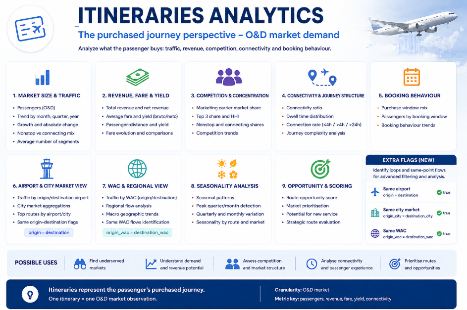

# Itineraries Analytics

## Purchased O&D demand

The itinerary layer represents the complete journey purchased by the passenger, from the initial origin to the final destination. A journey can be nonstop or can contain several physical flights, but it remains one O&D market observation.

This is the appropriate level for analysing market demand and ticket-level commercial variables. A passenger travelling A–C via B contributes once to the A–C itinerary market, even though the same journey later generates two physical passenger-segments.

## Market size, value and evolution

The core results allow markets to be compared through passenger volume, total and approximate net revenue, weighted average fare, yield, passenger-distance, distance and period growth.

This makes it possible to separate several ideas that are often mixed together: a market can be large but relatively low-fare, small but high-yield, or attractive because of a combination of size, value and recent growth.

## Competition

Carrier summaries describe who captures the purchased O&D market. The results include leaders, shares, coverage, carrier counts, HHI and top-three concentration for the carrier roles supported by each source.

Coverage remains visible because unidentified carrier values stay in the market total without being converted into an artificial competitor.

## Connectivity and journey complexity

The itinerary outputs separate nonstop and connecting demand and describe the number of segments used by passengers. This allows markets with substantial traffic but high connection dependence to be identified.

The result is useful for route-opportunity screening: it shows that demand already exists between two endpoints and how much of it currently requires intermediate flights. It is not, by itself, a route-opening recommendation.

## Booking behaviour

Where purchase-window information exists, the results show passenger distribution and average fare by booking group. This helps compare how early or late different markets tend to be purchased and whether fare behaviour differs across the available source categories.

## Airport, city-market and WAC views

Demand can be examined at airport, city-market and WAC levels, with directional and bidirectional keys. This supports both detailed airport-pair analysis and broader metropolitan or regional analysis.

## Seasonality

Quarterly outputs describe the seasonal profile of each market, including peak periods and relative seasonal intensity. Markets with similar annual traffic can therefore be distinguished by whether demand is stable or concentrated in a short peak.

## Opportunity indicators

The final itinerary view combines market size, fare, yield, connectivity, competition and other available signals into relative rankings. The scores are intended to prioritise markets for deeper analysis rather than predict future traffic or profitability.

## Same-origin and destination flags

Boolean fields identify whether origin and destination are the same at airport, city-market or WAC level. These flags can be used to remove same-point markets from standard rankings, study repeated/circular flows separately, or review unusual observations.

## From itinerary market to physical network

Once an O&D market has been selected, the integrated layer can continue the analysis through `bridge_od_city_segment`. The bridge identifies which physical segments carry that city-market demand and how important each leg is within the market.

This is an analytical market-to-segment relationship. The lower-level row-by-row connection between an individual itinerary and its individual segments is maintained earlier in the pipeline through `itinerary_id`.

## Final itinerary outputs

| Output | Main analytical question |
|---|---|
| [`market_core_summary`](../examples/itineraries/market_core_summary.csv) | How large and valuable is the market? |
| [`market_competition_summary`](../examples/itineraries/market_competition_summary.csv) | Who captures the market and how concentrated is it? |
| [`market_connectivity_summary`](../examples/itineraries/market_connectivity_summary.csv) | How much demand is nonstop or connecting? |
| [`market_booking_summary`](../examples/itineraries/market_booking_summary.csv) | How does booking timing relate to passengers and fare? |
| [`market_airport_summary`](../examples/itineraries/market_airport_summary.csv) | What happens at airport-pair level? |
| [`market_wac_summary`](../examples/itineraries/market_wac_summary.csv) | How does demand look at WAC/regional level? |
| [`market_seasonality_summary`](../examples/itineraries/market_seasonality_summary.csv) | How seasonal is the market? |
| [`market_opportunity_summary`](../examples/itineraries/market_opportunity_summary.csv) | Which markets rank strongly under the configured criteria? |
