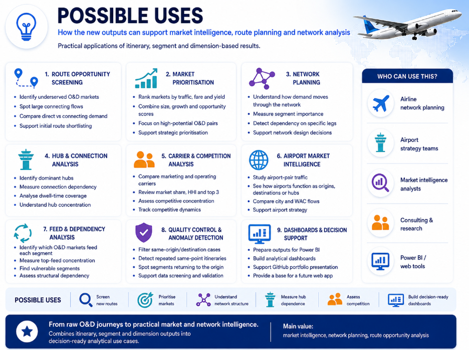

# Possible Uses

## Market and network decision support

The project is designed to support screening, comparison and prioritisation using BTS O&D data. It does not replace airline schedule, aircraft, cost or profitability models, but it provides a structured way to identify the markets and network elements that deserve deeper analysis.

## Route-opportunity screening

Itinerary analytics can identify markets combining strong passenger volume, fare/yield, growth, high connection share, journey complexity and competitive characteristics.

The bridge adds a second layer: once a market is selected, it shows the exact physical segments currently carrying that demand. This helps understand whether the market is concentrated on one routing, distributed across several hubs or dependent on a small set of network legs.

## Network planning

Segment outputs can identify:

- high-traffic or high-passenger-distance legs;
- segments strongly dependent on connecting itineraries;
- legs with concentrated marketing or operating carriers;
- segments supported by many O&D feeds;
- segments dependent on one or a few passenger markets;
- network elements ranking highly on relative importance or dependency indicators.

## Two-way market ↔ segment analysis

`bridge_od_city_segment` enables one of the most useful workflows in the project.

### Starting from a market

A planner can select a large or strategically interesting O&D city market and identify:

- every physical segment used by that market;
- the main segment;
- each segment's weight inside the market;
- the network and competitive profile of those legs;
- the hubs through which connecting passengers travel.

### Starting from a segment

The same table can be reversed to identify:

- every O&D city market using the segment;
- how much each market contributes;
- the largest feeds;
- whether the segment is diversified or feed-dependent;
- which important itinerary markets share the same physical leg.

This bidirectional view is especially useful because the importance of a relationship changes depending on whether the denominator is the O&D market or the physical segment.

## Hub analysis

Connection results support analysis of main hubs, number of alternatives, hub concentration and valid dwell times.

This can help distinguish markets highly dependent on one connection point from markets distributed across a broader network.

## Carrier and competition analysis

The project allows market-level carrier concentration to be compared with segment-level marketing and operating carrier structures.

Potential uses include identifying:

- dominant carriers in an O&D market;
- segments operated by a single carrier but marketed by several;
- markets whose main network path is controlled by one operator;
- commercially competitive markets with operational concentration.

## Airport and regional intelligence

Airport, city-market and WAC dimensions make it possible to compare demand and network use at different geographic levels.

The analysis can be used to study an airport as:

- final origin or destination;
- part of a physical segment;
- connection point;
- node supported by multiple O&D markets;
- location associated with same-origin/destination cases.

## Feed and dependency analysis

The segment feed and bridge outputs can reveal whether traffic is broadly diversified or concentrated.

This supports questions such as:

- Which physical segments depend most on a small set of O&D markets?
- Which O&D markets rely most heavily on a small number of segments?
- Which network legs are shared by many important passenger flows?
- Which markets would be most relevant to the role of a selected segment?

## Same-location and anomaly screening

Same-airport, same-city-market and same-WAC flags can be used to:

- exclude same-point flows from conventional market rankings;
- analyse circular/repeated flows separately;
- isolate unusual physical segment records;
- support data-quality review;
- rank locations with a high number of same-origin/destination observations.

The flags identify equal endpoints only; they do not prove the operational reason for a record.

## Dashboards and future tools

The final tables are compact enough to support Power BI, DuckDB queries and future interactive market/network tools.

A user can begin with a market, segment, carrier, hub, period or region and progressively move into the related analytical outputs without loading the raw BTS survey files.

## Example questions

The project can support questions such as:

- Which O&D markets are large, valuable and highly connected?
- Which physical segments carry a selected high-volume market?
- What share of an O&D market uses each leg?
- Which O&D markets feed a selected segment?
- What share of the segment does each feed represent?
- Which segments are most dependent on connections?
- Which hubs dominate a market's connecting traffic?
- How concentrated are marketing and operating carriers?
- Which network legs are structurally important or dependent?
- Which same-origin/destination cases should be filtered or reviewed?

These outputs are intended as analytical evidence for deeper planning work, not as automatic operational or investment decisions.
