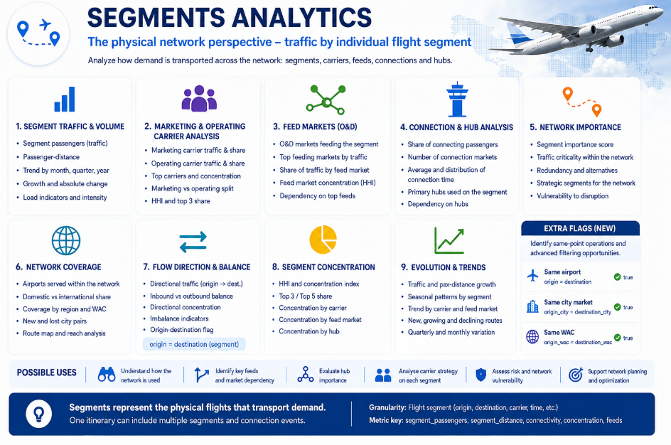

# Segments Analytics

## Physical network use

The segment layer represents each physical flight leg used to transport O&D demand. A passenger travelling A–C via B produces one itinerary observation but two passenger-segment observations: A–B and B–C.

This perspective therefore explains **how the purchased demand moves through the network**.

## Physical traffic and distance

`segment_core_summary` measures passenger-segment traffic, passenger-distance, weighted segment distance, period growth and the balance between traffic belonging to nonstop O&D journeys and traffic belonging to connecting itineraries.

Two legs with the same passenger count can have very different roles if one mainly serves local demand while the other is heavily dependent on connections.

## Marketing and operating carriers

Marketing and operating carrier are analysed separately. This is important for codeshare and operating arrangements because a segment may be sold by several airlines but physically operated by only one.

The competition output includes coverage, leaders, shares, carrier counts, HHI and top-three concentration for both carrier roles.

## O&D feeds

`segment_feed_summary` starts with a physical segment and asks which O&D markets feed it. It identifies the number of known feeds, the leading O&D market and the concentration of those feeds.

This helps distinguish a diversified leg from one that depends heavily on one or a small number of passenger markets.

## Segments used by each market

`market_segment_summary` starts from the opposite direction. It summarises how many physical segments are used by an O&D market, the primary segment, its share and the concentration of the segment mix.

It is useful for understanding the routing structure behind a large or heavily connecting market.

## Hubs and dwell

`market_connection_summary` describes the connection points used by an O&D market, including the main hub, hub concentration, number of known hubs and valid dwell-time coverage.

Valid dwell values are treated separately from the source's special codes for surface sectors, connections longer than 24 hours and unknown/not-applicable cases.

## Network summary

The corrected `segment_network_summary` combines the core physical-traffic view with carrier competition, O&D feeds and network scores. It is therefore the final high-level segment table rather than a duplicate of `segment_feed_summary`.

It can be used to compare segments by:

- traffic and passenger-distance;
- connection dependency;
- marketing and operating carrier concentration;
- feed-market concentration;
- relative network importance;
- dependency risk;
- competitive concentration.

## O&D city-market ↔ segment bridge

`bridge_od_city_segment` is the most detailed analytical relationship table between the O&D market and the physical network.

Its grain is:

> **period + origin city market + destination city market + physical airport segment**

Each row includes the passenger-segment volume associated with that exact market–segment combination and two complementary shares:

### `segment_mix_share_within_od`

This answers:

> Within the selected O&D market, how important is this physical segment?

It allows a market to be opened up into the legs that carry it.

### `od_feed_share_within_segment`

This answers:

> Within the selected physical segment, how important is this O&D market?

It allows a physical leg to be opened up into the passenger markets that feed it.

Because both shares live in the same bridge row, the same relationship can be analysed in either direction without changing the underlying market–segment pair.

The bridge belongs with the segment/integrated outputs rather than Dimensions because it is not a lookup table. It contains traffic measures and relationship shares at a many-to-many analytical grain.

## Same-origin and destination flags

Segment flags identify equal origin/destination airport, city-market or WAC values. They can support filtering and anomaly review, but they do not establish why such a record occurred operationally.

## Final segment outputs

| Output | Main analytical question |
|---|---|
| [`segment_core_summary`](../examples/segments/segment_core_summary.csv) | How much physical traffic does the leg carry? |
| [`segment_competition_summary`](../examples/segments/segment_competition_summary.csv) | Who markets and operates the leg? |
| [`segment_feed_summary`](../examples/segments/segment_feed_summary.csv) | Which O&D markets feed the leg? |
| [`market_segment_summary`](../examples/segments/market_segment_summary.csv) | Which legs are used by the O&D market? |
| [`market_connection_summary`](../examples/segments/market_connection_summary.csv) | Which hubs does the O&D market use? |
| [`segment_network_summary`](../examples/segments/segment_network_summary.csv) | What is the segment's combined network profile? |
| [`bridge_od_city_segment`](../examples/segments/bridge_od_city_segment.csv) | What is the detailed market–segment relationship in both directions? |
